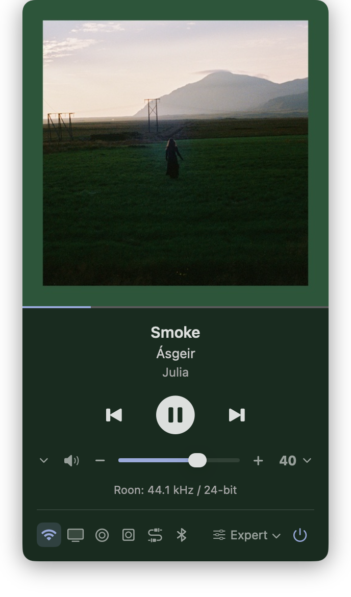

# KEF Control

A small macOS menu bar app for KEF wireless speakers. It talks directly to the
speaker over your local network — no cloud account, no bridge process, no
background helper.



## What it does

- Volume, mute and transport, with a scrubbable progress bar
- Now playing: title, artist, album and cover art
- **Audio format** of the incoming stream, read from the speaker itself —
  e.g. `Roon · 96 kHz / 24-bit`, `Spotify · Lossless`, `Tidal · 44.1 kHz / 16-bit`
- Input switching: Wi-Fi, TV, Optical, Coaxial, Analog, USB, Bluetooth —
  reorderable, and you can hide the ones your model doesn't have
- **EQ profile switching**, applied through the speaker's authenticated DSP
  channel
- **Radio presets**: up to 7 internet radio stations as one-click buttons,
  picked from the stations your speaker already knows
- Seven volume presets, and global hotkeys for everything (unassigned by
  default)
- **Automatic discovery** of speakers on your network over Bonjour — no IP
  hunting on first run

Everything is optional — rows stay hidden until you configure them.

## Requirements

- macOS 26 or later (Apple silicon or Intel; the build is universal)
- A KEF speaker on the W2 streaming platform: **LS50 Wireless II**, **LS60
  Wireless**, or **LSX II / LSX II LT**
- The speaker on the same LAN (it is found automatically over Bonjour)

Only the LS60 has been tested. Other W2 models share the same API and should
work; reports welcome.

## Install

### Download

Grab the latest zip from [Releases](../../releases), unzip it, and drag
**KEF Control.app** to `/Applications`.

The app is ad-hoc signed but **not notarized** (that needs a paid Apple
Developer account), so macOS quarantines it on download and claims it is
"damaged". It isn't — clear the flag once:

```sh
xattr -dr com.apple.quarantine "/Applications/KEF Control.app"
```

Then open it normally. Each release lists a SHA-256 you can check with
`shasum -a 256 KEF-Control-<version>.zip`.

### Or build from source

A minute's work, and it sidesteps the quarantine entirely — locally built
binaries are never quarantined:

```sh
git clone https://github.com/renebouwmeester/KEF-Control.git
cd KEF-Control
./build.sh
open -a "KEF Control"
```

`build.sh` compiles with `swiftc` (no Xcode project needed), makes a universal
binary, and installs to `~/Applications/KEF Control.app`. Xcode Command Line
Tools are the only prerequisite: `xcode-select --install`.

To launch it at login, add it in System Settings → General → Login Items.

## First run

**Usually nothing to do.** KEF speakers advertise themselves over Bonjour
(`_kef-info._tcp`), so on first launch the app looks for one and adopts it
automatically if it finds exactly one.

If you have several speakers — or none is found — **right-click the menu bar
icon → Settings…** The Speaker tab lists everything discovered on the network
by name and model ("KEF LS60 — LS60 Wireless"); you can also type an address
by hand. A static DHCP lease is worth setting up so it doesn't move.

Everything else lives in the same Settings window, one tab each:

- **Sources** — drag to reorder the input buttons, toggle to hide the ones
  your model doesn't have
- **Radio** — assign stations to the quick-play row
- **Volume** — the seven volume presets and their hotkeys
- **Hotkeys** — global playback and volume shortcuts

Changes apply when you press Save.

### Radio presets

Stations are offered from the speaker's own airable radio **history and
favourites**, so play a station once in KEF Connect and it will appear in the
picker. Presets are stored locally by this app; nothing is written back to your
airable account.

## Settings

Preferences live in `UserDefaults` under the app's bundle id, outside the
bundle — reinstalling or rebuilding never loses them. To start clean:

```sh
defaults delete <bundle-id>
```

## Notes and limitations

- **EQ profiles** are read from the speaker and re-applied through its
  authenticated channel (TLS, HMAC-signed). Only the *active* profile is
  readable locally; the app snapshots each one as you select it in KEF Connect,
  so profiles appear in the menu after you've used them once.
- **Audio format is only reported for streaming sources.** Physical inputs (TV,
  optical, coaxial, analog) return no format information at all, so the caption
  is hidden for them — the speaker genuinely does not expose it.
- **Spotify reports no numbers**, only a lossless flag, so it shows
  `Spotify · Lossless` or `Spotify · Lossy` rather than a rate and depth.
- **Seek** only works where the source advertises it. Roon RAAT does not: the
  speaker is a slave renderer there and rejects the command.
- The app polls the speaker every 2 seconds while the panel is open.

## Credits

The authenticated DSP channel and the internet-radio playback sequence were
both worked out from [hilli/go-kef-w2](https://github.com/hilli/go-kef-w2)
(MIT), which is the best reference for this API. No code was copied — both were
reimplemented in Swift — but the project saved a great deal of guesswork.

Not affiliated with, endorsed by, or supported by KEF or GP Acoustics. The
Bluetooth figure mark is a trademark of Bluetooth SIG, Inc.

## Licence

MIT — see [LICENSE](LICENSE).
